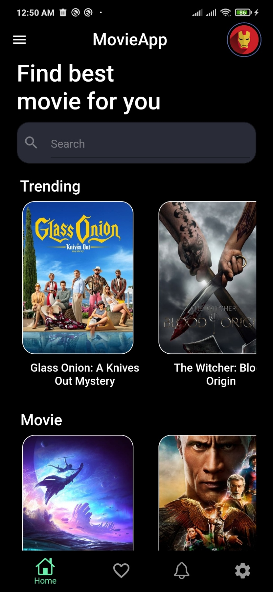
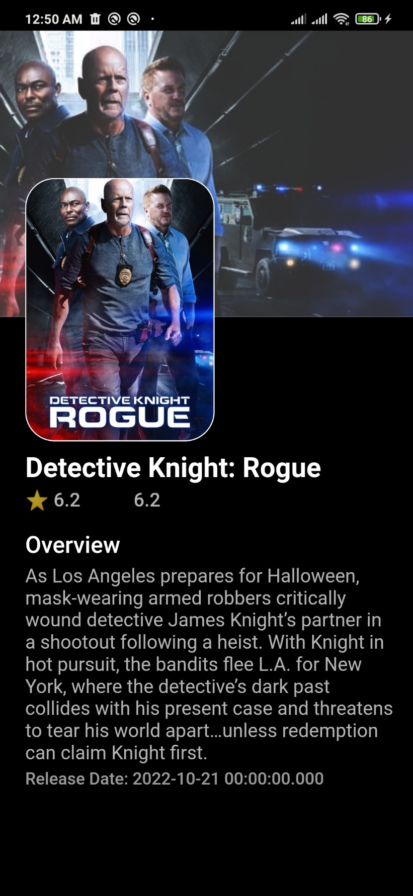
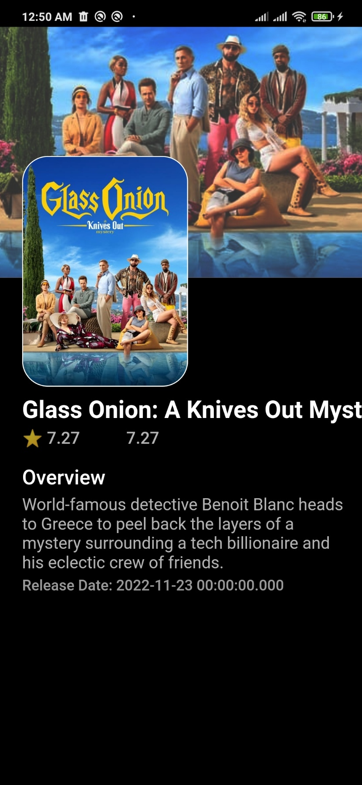
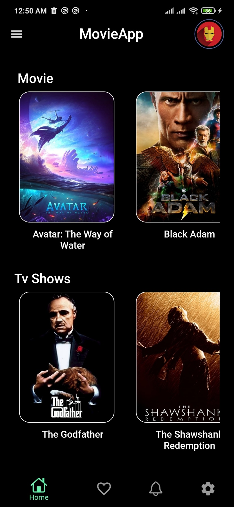

<!--Heading-->
# Movie App
Flutter representation of a Movie Plants Information System(Application) that provides information about movies using flutter http.

Star⭐ the repo if you like what you see😉.

# About 
Introducing the  movie app for film fans, built using the powerful Flutter API! The app provides in-depth information about a wide range of movies, including the title,  description... Whether you're looking for the latest blockbuster hits or classic films from decades past, our app has something for everyone.

Welcome to my movie app! Here, you can access information about your favorite films, including their title, language, release date, description, and rating. Whether you're a movie buff looking for your next great watch or just want to find out more about a particular film, our app has you covered. With a comprehensive database of movies from all genres and eras, you'll be able to easily find what you're looking for. Plus, with user ratings and reviews, you can get a sense of what other viewers thought about the film before making your own decision. 

The app is build using flutter http.

## 📸 ScreenShots
Here are some screnshot of UI of the application.

  
   

  
   

   

# Working

The application uses api to take data from cloud  storage and represent it to the user.

##

# Software & Tools

  
   
  
   

# Social 

[Linkedin](https://www.linkedin.com/in/saurav-chaulagain-500502254/)

[Facebook](https://www.facebook.com/profile.php?id=100082619644241)

[Website](https://sauravchaulagain.github.io/#/)

[Instagram](https://www.instagram.com/sau__rav__________/)

Gmail: sauravchaulagain39@gmail.com

